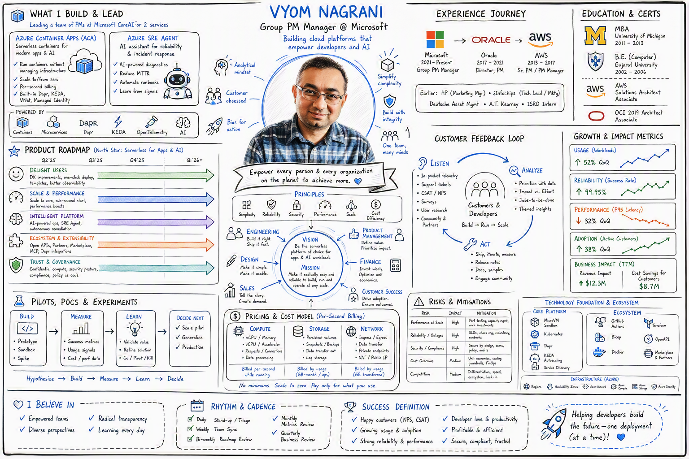

Welcome to the source code for [Vyom Nagrani's personal website](https://vyomnagrani.github.io/), a portfolio and professional profile.

### 🚀 Overview

This site showcases Vyom Nagrani's background, experience, education, certifications, publications, and leadership roles. It is designed as a modern, responsive single-page website using HTML and CSS.

### 📁 Project Structure

- `index.html` — Main HTML file for the website.
- `styles.css` — Custom CSS styles for layout and design.
- `VyomNagraniProfileInfo.png` — Profile overview displayed in the homepage hero.
- `VyomNagraniProfile.jpg` — Portrait displayed in the About Me section.

### 🛠️ Features

- **Responsive Design:** Looks great on desktop and mobile devices.
- **Navigation:** Smooth navigation bar for easy access to all sections.
- **Professional Sections:** About, Experience, Education, Certifications, Publications, Leadership, and Contact.
- **Modern Aesthetics:** Clean, readable fonts and a professional color palette.

### 🖼️ Preview



### 📦 Getting Started

To view or modify the site locally:

1. Clone the repository:
   ```
   git clone https://github.com/vyomnagrani/vyomnagrani.github.io.git
   ```
2. Open `index.html` in your web browser.

### ✍️ Customization

- Update `index.html` to change content or add new sections.
- Modify `styles.css` for custom styles or color schemes.
- Replace `VyomNagraniProfileInfo.png` to update the hero overview.
- Replace `VyomNagraniProfile.jpg` to update the About Me portrait.

### 📬 Contact

For feedback or collaboration, please use the [Contact](#contact) section on the website.

---

© Vyom Nagrani. All rights reserved.